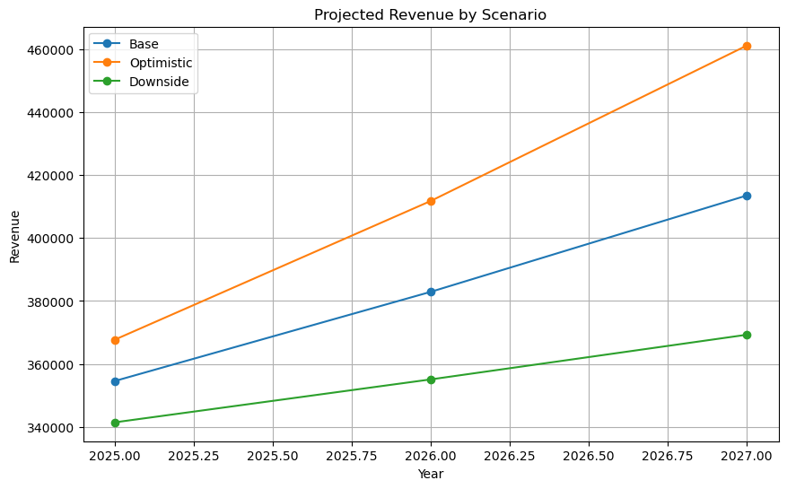
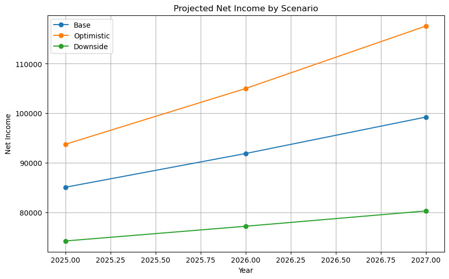
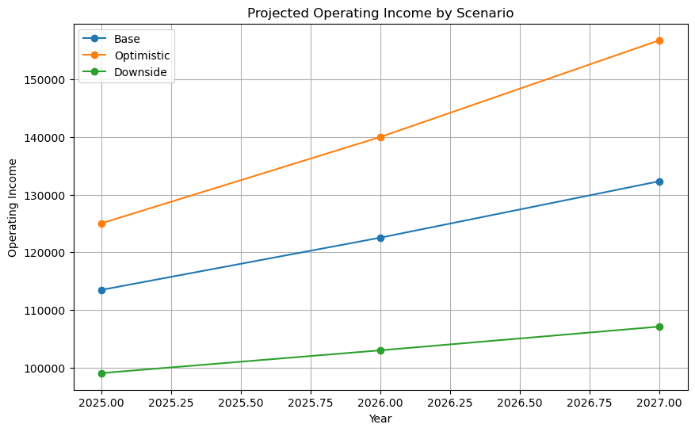

# Big Tech FP&A Scenario Planning Model

## Overview
This project builds a multi-scenario FP&A model to project revenue, operating income, and net income for a large technology company under base, optimistic, and downside cases.

## Visualization

## Tools Used
- Python
- Pandas
- Matplotlib

## Key Outputs
- Multi-year revenue forecasting
- Scenario-based net income projections
- Margin-driven FP&A planning analysis
- Executive-style planning visuals
